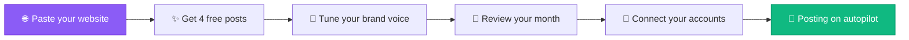
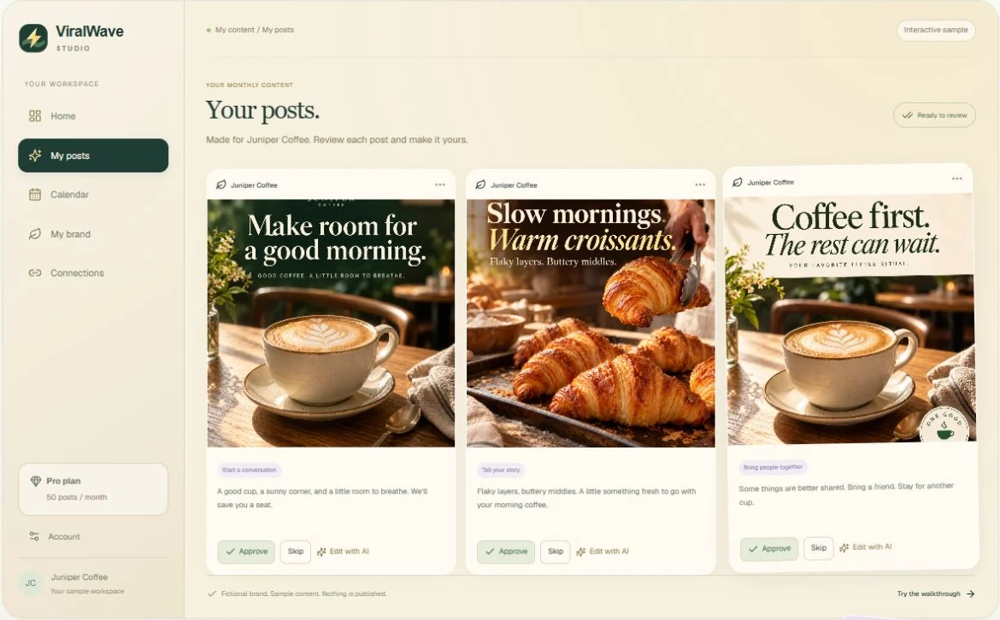

<p align="center">
  
</p>

<p align="center">
  <strong>The complete guide to putting your social media content on autopilot.</strong><br/>
  Setup walkthrough · Features · Brand voice · Review workflow · AI agent integrations · Plans · FAQ
</p>

<p align="center">
  <a href="https://viralwavestudio.com"></a>
  <a href="LICENSE"></a>
</p>

<p align="center">
  
  
  
  
  
  
  
  
</p>

---

## What is ViralWave Studio?

**ViralWave Studio** is an AI-powered content platform that takes your marketing from manual to autopilot. Instead of generating posts one by one in a dashboard, you paste in your website — and ViralWave builds you a full month of finished social media content with captions and images, ready for your approval.



No blank page. No daily "what should I post." Your month of content, done.

<p align="center">
  <a href="https://viralwavestudio.com"><strong>→ Start free at viralwavestudio.com</strong></a>
</p>

## 📸 See it in action

Your month, ready for review — approve, skip, or edit with AI:

<p align="center">
  
</p>

The free preview — swipe through your first four posts:

<p align="center">
  
</p>

## 🎨 Sample output

Real post creatives generated by ViralWave Studio for fictional brands — this is the quality bar your month ships at:

<p align="center">
  
  
</p>
<p align="center">
  
  
</p>
<p align="center">
  <a href="https://viralwavestudio.com"><strong>→ Get posts like these for your business — free</strong></a>
</p>

## 📚 What's in this repo

| Guide | What you'll learn |
|---|---|
| [01 — Getting started](guides/01-getting-started.md) | The full onboarding flow: website → 4 free posts → your first month |
| [02 — Features](guides/02-features.md) | Post generator, video lab, blog generator, AI images, analytics, and more |
| [03 — Brand voice](guides/03-brand-voice.md) | How ViralWave learns to sound like you (and how to tune it) |
| [04 — Review workflow](guides/04-review-workflow.md) | Approve, skip, edit: the 10-minute monthly review |
| [05 — Connecting platforms](guides/05-connecting-platforms.md) | Facebook, Instagram, LinkedIn, X, Threads, Pinterest, TikTok, YouTube |
| [06 — AI agents & MCP](guides/06-ai-agents-mcp.md) | Connect Codex, ChatGPT, and Claude straight to your ViralWave account |
| [07 — Plans & pricing](guides/07-plans-and-pricing.md) | Starter, Pro, and Powerhouse — what you get at each tier |
| [08 — FAQ](guides/08-faq.md) | The questions everyone asks, answered straight |

Plus [`examples/`](examples/) with ready-to-use configs for connecting AI assistants.

## ⚡ The 5-minute tour

**🌐 Your website becomes your content engine.** ViralWave's crawler reads your site — your services, your tone, your offers — and builds a brand profile from it. No forms to fill out, no brief to write. If you have a website, you're already 80% onboarded.

**✨ Four free posts, zero risk.** Before you pay anything, you get four finished posts with captions and images. Not samples, not templates — real content for your business, generated from your website. If you don't love them, you walk away having spent nothing.

**📅 A month of content, not a post at a time.** After you pick a plan, ViralWave generates your full month — around 50 posts with a balanced mix of educational, behind-the-scenes, social proof, story, and promotional content. You review them the way you'd swipe through photos: approve, skip, or ask the AI to revise.

**🚀 Publishing on autopilot.** Once your month is approved and your accounts are connected, posting runs automatically. Eight platforms, one approval.

<p align="center">
  <a href="https://viralwavestudio.com"><strong>→ See it for yourself — free at viralwavestudio.com</strong></a>
</p>

## 🧰 Feature highlights

| | |
|---|---|
| ✍️ **AI post generator** | A month of captions and creative direction from your website |
| 🖼️ **AI image generation** | On-brand images for every post, matched to your visual identity |
| 🎬 **Video lab** | AI-generated video for Reels, TikTok, and Shorts |
| 📝 **Blog generator** | SEO-structured blog posts that feed your social content too |
| 🙂 **Face-reference brand authority** | Your likeness, consistently on-brand, in generated visuals |
| 🗓️ **Smart scheduler** | Your approved month queued across 8 platforms |
| 📊 **Analytics with AI insights** | See what's working without building spreadsheets |
| 🤖 **Marketing assistant** | An AI chatbot for content strategy questions |
| 📡 **RSS-to-posts** | Turn your blog or industry feeds into social content automatically |
| 🔌 **AI agent integrations (MCP)** | Connect Codex, ChatGPT, or Claude directly to your account |

Deep dive: [02 — Features](guides/02-features.md)

## 🎯 Who it's for

- **🏪 Local businesses** — plumbers, salons, restaurants, clinics — that need to post consistently but don't have a marketing person
- **🎥 Creators and coaches** — who live on content but are tired of the daily grind
- **💼 Agencies and freelancers** — managing content for multiple clients from one place
- **🚀 Founders** — who know they should be posting and finally want it handled

*If you've ever thought "I know I should post more, I just don't have time" — that's the person this was built for.*

## 💳 Plans

| | **Starter** | **Pro** | **Powerhouse** |
|---|---|---|---|
| **Price** | $15/mo | $29/mo | $49/mo |
| **Best for** | Solo operators getting consistent | Growing brands posting everywhere | Power users & teams maxing output |

Annual billing saves 20%. Full breakdown: [07 — Plans & pricing](guides/07-plans-and-pricing.md)

<p align="center">
  <a href="https://viralwavestudio.com"></a>
</p>

## 🔌 Connect your AI assistant

ViralWave exposes a secure MCP server at `https://viralwavestudio.com/mcp`. Connect Codex, ChatGPT, or Claude with OAuth — no API keys to manage — and ask your assistant to check your brand voice, review drafts, or queue posts.

```toml
# Codex CLI — ~/.codex/config.toml
[mcp_servers.viralwave]
url = "https://viralwavestudio.com/mcp"
```

Full setup for all three assistants: [06 — AI agents & MCP](guides/06-ai-agents-mcp.md)

## ❓ FAQ (short version)

**Do I need a website?** It makes onboarding dramatically better, but you can also describe your business manually.

**Does it actually post for me?** Yes — once you've approved your month and connected your accounts with publishing enabled, posting runs automatically.

**Can I edit the AI's posts?** Every post is yours to approve, skip, edit, or send back for AI revision before anything goes live.

**What if I hate the first 4 free posts?** Then you've learned something for free. But most people don't — they're built from your actual website, not a template.

More: [08 — FAQ](guides/08-faq.md)

## 🤝 Contributing

Spotted something outdated in the guides? PRs welcome — see [CONTRIBUTING.md](CONTRIBUTING.md).

## 📄 License

MIT — see [LICENSE](LICENSE).

---

<p align="center">
  <strong>Your website in. A month of content out.</strong><br/>
  <a href="https://viralwavestudio.com">viralwavestudio.com</a>
</p>
